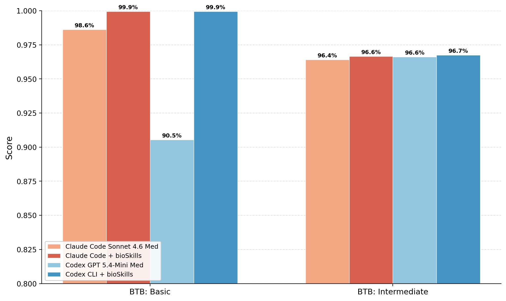

# bioSkills

A collection of skills that guide AI coding agents (Claude Code, OpenAI Codex, Google Gemini, OpenCode, OpenClaw) through common bioinformatics tasks.

## Project Goal

This repository provides AI agents with expert knowledge for bioinformatics workflows. Each skill contains code patterns, best practices, and examples that help agents generate correct, idiomatic code for common tasks.

Target users range from undergrads learning computational biology to PhD researchers processing large-scale data. The skills cover the full spectrum from basic sequence manipulation to advanced analyses like single-cell RNA-seq and population genetics.

## Performance

Evaluation summary report available at [bioskills_eval_20260328.pdf](resources/bioskills_eval_20260328.pdf). Evaluations were performed on the [Bio-Task Bench](https://github.com/GPTomics/bioTaskBench) dataset. 



## Requirements

### Python
- Python 3.9+
- biopython, pysam, cyvcf2, pybedtools, pyBigWig, scikit-allel, anndata

```bash
pip install biopython pysam cyvcf2 pybedtools pyBigWig scikit-allel anndata mygene
```

### R/Bioconductor
Required for differential expression, single-cell, pathway analysis, and methylation skills.

```r
if (!require('BiocManager', quietly = TRUE))
    install.packages('BiocManager')
BiocManager::install(c('DESeq2', 'edgeR', 'Seurat', 'clusterProfiler', 'methylKit'))
```

### CLI Tools
```bash
# macOS
brew install samtools bcftools blast minimap2 bedtools

# Ubuntu/Debian
sudo apt install samtools bcftools ncbi-blast+ minimap2 bedtools

# conda
conda install -c bioconda samtools bcftools blast minimap2 bedtools \
    fastp kraken2 metaphlan sra-tools bwa-mem2 bowtie2 star hisat2 \
    manta delly cnvkit macs3 macs2 genrich tobias rgt-hint idr picard \
    preseq deeptools chromap subread fithichip gatk4
```

## Installation

### Claude Code

```bash
git clone git@github.com:GPTomics/bioSkills.git
cd bioSkills
./install-claude.sh                              # Install globally
./install-claude.sh --project /path/to/project   # Or install to specific project
./install-claude.sh --categories "single-cell,variant-calling"  # Install specific categories
./install-claude.sh --list                       # List available skills
./install-claude.sh --validate                   # Validate all skills
./install-claude.sh --update                     # Only update changed skills
./install-claude.sh --uninstall                  # Remove all bio-* skills
```

### Codex CLI

```bash
./install-codex.sh                               # Install globally
./install-codex.sh --project /path/to/project    # Or install to specific project
./install-codex.sh --categories "single-cell,variant-calling"  # Install specific categories
./install-codex.sh --list                        # List available skills
./install-codex.sh --validate                    # Validate all skills
./install-codex.sh --update                      # Only update changed skills
./install-codex.sh --uninstall                   # Remove all bio-* skills
```

### Antigravity CLI

Antigravity CLI replaces Gemini CLI (sunset 2026-06-18) and uses the open Agent Skills standard. Global installs land at `~/.gemini/antigravity/skills/`; project installs land at `.agents/skills/`.

```bash
./install-antigravity.sh                              # Install globally
./install-antigravity.sh --project /path/to/project   # Or install to specific project
./install-antigravity.sh --categories "single-cell,variant-calling"  # Install specific categories
./install-antigravity.sh --list                       # List available skills
./install-antigravity.sh --validate                   # Validate all skills
./install-antigravity.sh --update                     # Only update changed skills
./install-antigravity.sh --uninstall                  # Remove all bio-* skills
```

### OpenCode

```bash
./install-opencode.sh                            # Install globally to ~/.config/opencode/skills/
./install-opencode.sh --project /path/to/project # Or install to specific project
./install-opencode.sh --categories "single-cell,variant-calling"  # Install specific categories
./install-opencode.sh --list                     # List available skills
./install-opencode.sh --validate                 # Validate all skills
./install-opencode.sh --update                   # Only update changed skills
./install-opencode.sh --uninstall                # Remove all bio-* skills
```

OpenCode also auto-discovers Agent Skills from `~/.claude/skills/` and `~/.agents/skills/`, so installs produced by `install-claude.sh` or `install-codex.sh` work in OpenCode without re-running.

### OpenClaw

Install directly from [ClawHub](https://clawhub.ai/djemec/bioskills), or use the install script:

```bash
./install-openclaw.sh                            # Install all skills globally
./install-openclaw.sh --categories "single-cell,variant-calling"  # Install specific categories
./install-openclaw.sh --project /path/to/workspace  # Install to workspace
./install-openclaw.sh --tool-type-metadata       # Add OpenClaw dependency metadata
./install-openclaw.sh --dry-run                  # Preview install + token estimate
./install-openclaw.sh --list                     # List available skills
./install-openclaw.sh --validate                 # Validate all skills
./install-openclaw.sh --update                   # Only update changed skills
./install-openclaw.sh --uninstall                # Remove all bio-* skills
```

All installers support `--categories` for selective installation and `--dry-run` for previewing. Codex, Gemini, and OpenCode convert to the Agent Skills standard (`examples/` -> `scripts/`, `usage-guide.md` -> `references/`). OpenClaw keeps the original directory structure and optionally adds dependency metadata with `--tool-type-metadata`.

## Skill Categories

| Category | Skills | Primary Tools | Description |
|----------|--------|---------------|-------------|
| **sequence-io** | 9 | Bio.SeqIO | Read, write, convert FASTA/FASTQ/GenBank and 40+ formats |
| **sequence-manipulation** | 7 | Bio.Seq, Bio.SeqUtils | Transcription, translation, motif search, sequence properties |
| **database-access** | 11 | Bio.Entrez, BLAST+, SRA toolkit, UniProt API, STRINGdb | NCBI/UniProt queries, SRA downloads, BLAST, homology searches, interaction databases |
| **alignment-files** | 10 | samtools, pysam | SAM/BAM/CRAM viewing, sorting, filtering, statistics, validation, amplicon clipping |
| **variant-calling** | 13 | bcftools, GATK, DeepVariant, Manta, Delly, VEP | Germline/SV calling, DRAGEN-GATK mode, VQSR/hard filtering, MANE annotation, ACMG interpretation |
| **alignment** | 7 | Bio.Align, MAFFT, MUSCLE5, Foldseek, ClipKIT | MSA tools (incl. BAli-Phy joint MSA+tree co-estimation), pairwise alignment, structural alignment (Foldseek/Foldseek-Multimer/TM-align/US-align/DALI/Foldmason), post-MSA trimming (ClipKIT/trimAl/BMGE/PhyIN), alignment I/O, MSA statistics |
| **phylogenetics** | 8 | Bio.Phylo, IQ-TREE2, RAxML-NG, MrBayes, BEAST2, ASTRAL-III | Tree I/O, ML/Bayesian inference, divergence dating, coalescent species trees, concordance factors |
| **differential-expression** | 6 | DESeq2, edgeR, ggplot2, pheatmap | RNA-seq differential expression, visualization, batch correction |
| **structural-biology** | 6 | Bio.PDB, ESMFold, Chai-1 | PDB/mmCIF parsing, SMCRA navigation, geometric analysis, ML structure prediction |
| **single-cell** | 14 | Seurat, Scanpy, Pertpy, Cassiopeia, MeboCost | scRNA-seq QC, clustering, trajectory, communication, annotation, perturb-seq, lineage tracing, metabolite communication |
| **pathway-analysis** | 6 | clusterProfiler, ReactomePA, rWikiPathways, enrichplot | GO, KEGG, Reactome, WikiPathways enrichment; ORA vs GSEA guidance, prokaryotic support, background universe, multi-condition comparison |
| **restriction-analysis** | 4 | Bio.Restriction | Restriction sites, mapping, enzyme selection |
| **methylation-analysis** | 5 | Bismark, methylKit, bsseq, scipy | Bisulfite alignment, methylation calling, per-CpG testing, DMRs |
| **chip-seq** | 7 | MACS3, ChIPseeker, DiffBind | Peak calling, annotation, differential binding, motifs, QC, super-enhancers |
| **metagenomics** | 7 | Kraken2, MetaPhlAn, Bracken, HUMAnN | Taxonomic classification, abundance estimation, functional profiling, AMR detection |
| **long-read-sequencing** | 8 | Dorado, minimap2, Clair3, modkit, IsoSeq3 | Basecalling, alignment, polishing, variant calling, SV calling, methylation, Iso-Seq |
| **read-qc** | 7 | FastQC, MultiQC, fastp, Trimmomatic, Cutadapt | Quality reports, adapter trimming, filtering, UMIs |
| **genome-intervals** | 8 | bedtools, pybedtools, pyranges, gffutils, deepTools, pyBigWig | Coordinate systems, interval arithmetic, overlap significance, GTF/GFF, proximity, coverage, bedGraph/bigWig tracks |
| **population-genetics** | 6 | PLINK, FlashPCA2, ADMIXTURE, scikit-allel | GWAS, biobank-scale PCA, admixture, selection statistics |
| **rna-quantification** | 4 | featureCounts, Salmon, kallisto, tximport | Gene/transcript quantification, count matrix QC |
| **read-alignment** | 4 | bwa-mem2, bowtie2, STAR, HISAT2 | Short-read alignment for DNA and RNA-seq |
| **expression-matrix** | 5 | pandas, anndata, DESeq2, edgeR, biomaRt | Count matrix handling, normalization, gene ID mapping |
| **copy-number** | 11 | CNVkit, GATK4, ASCAT, Sequenza, FACETS, PURPLE, PureCN, DNAcopy, GISTIC2, scarHRD, AmpliconArchitect, Battenberg, TITAN, AnnotSV, ClassifyCNV | Read-depth CNV calling (CNVkit/GATK), CBS/HMM segmentation and depth-bias correction, allele-specific copy number with purity/ploidy, recurrent and driver CNV (GISTIC2) and copy-number signatures, gene/clinical annotation, ACMG/ClinGen germline CNV interpretation, HRD genomic-scar scoring, focal amplification and ecDNA architecture, subclonal CN and whole-genome doubling, CNV visualization |
| **phasing-imputation** | 4 | Beagle, SHAPEIT5, bcftools | Haplotype phasing, genotype imputation |
| **atac-seq** | 12 | MACS3, DiffBind, csaw, chromVAR, TOBIAS, scprinter, ArchR, Signac, SnapATAC2, Cicero, ABC, chromBPNet, BPNet, scBasset, EnFormer, WASP, GATK ASEReadCounter, RASQUAL | Peak calling (MACS/Genrich/HMMRATAC), ENCODE 4 QC with spike-in / sex-chr, fixed-width consensus peaksets, differential accessibility with permutation/spike-in/Hi-C-anchored, TF footprinting (bias correction including chromBPNet), motif variability (chromVAR/scBasset), nucleosome positioning (NucleoATAC/V-plots/H2A.Z), single-cell ATAC (Signac/ArchR/SnapATAC2/scArches), cis-regulatory co-accessibility (Cicero/SCENIC+), deep learning (chromBPNet/BPNet/scBasset/EnFormer; in silico variant effect; TF-MoDISco motif discovery), enhancer-gene linking (ABC, ENCODE-rE2G, HiChIP, CRISPRi-FlowFISH validation), allele-specific accessibility (WASP, GATK, RASQUAL caQTL) |
| **genome-assembly** | 9 | GenomeScope2, SPAdes, Flye, hifiasm, metaFlye, Pilon, YaHS, CheckM2, FCS-GX, QUAST, BUSCO, Merqury | Pre-assembly k-mer profiling, short/long/HiFi and metagenome assembly, polishing, Hi-C scaffolding, contamination detection, three-axis quality assessment |
| **primer-design** | 3 | primer3-py | PCR primer design, qPCR probes, validation |
| **spatial-transcriptomics** | 11 | Squidpy, SpatialData, Scanpy, scimap | Visium, Xenium, Slide-seq, spatial stats, domain detection, deconvolution, spatial proteomics |
| **hi-c-analysis** | 9 | cooler, cooltools, pairtools, HiCExplorer, chromosight, FitHiChIP | Read-pair processing and library QC, cooler matrices, ICE/KR balancing and P(s) expected, A/B compartments, TADs, loops, visualization, differential comparison, protein-directed 3C (HiChIP/PLAC-seq/Capture Hi-C) |
| **alternative-splicing** | 9 | rMATS-turbo, leafcutter, MAJIQ, SpliceAI, FRASER 2.0, FLAIR, IsoformSwitchAnalyzeR | Quantification, differential splicing, isoform switching/DTU, sashimi viz, splicing QC, single-cell splicing, splice variant prediction (SpliceAI), outlier detection (FRASER2/DROP), long-read splicing |
| **chemoinformatics** | 20 | RDKit, GNINA, ADMETlab 3.0, DiffDock-L, Boltz-2, REINVENT 4, AiZynthFinder, chemprop, OpenFE | Molecular I/O + standardization, conformer generation, descriptors, similarity / shape / pharmacophore, scaffold analysis, reactions / retrosynthesis, QSAR + generative design, ADMET, classical + ML docking + pose validation, free-energy calculations, covalent / PROTAC design |
| **liquid-biopsy** | 6 | ichorCNA, fgbio, VarDict, FinaleToolkit | cfDNA preprocessing, fragmentomics, tumor fraction, ctDNA mutations, longitudinal monitoring |
| **workflows** | 41 | Various (workflow-specific) | End-to-end pipelines: RNA-seq, variants, ChIP-seq, scRNA-seq, spatial, Hi-C, proteomics, microbiome, CRISPR, metabolomics, multi-omics, immunotherapy, outbreak, metabolic modeling, splicing, liquid biopsy, genome annotation, GRN, causal genomics, time-course, eDNA, clinical trials |
| **proteomics** | 9 | pyOpenMS, limma, DEqMS, QFeatures | Mass spec data import, QC, quantification, differential abundance, PTM, DIA |
| **microbiome** | 6 | DADA2, phyloseq, ALDEx2, QIIME2 | 16S/ITS amplicon processing, taxonomy, diversity, differential abundance |
| **multi-omics-integration** | 4 | MOFA2, mixOmics, SNF | Cross-modality integration, factor analysis, network fusion |
| **crispr-screens** | 8 | MAGeCK, JACKS, CRISPResso2, BAGEL2 | Pooled screen analysis, sgRNA efficacy modeling, hit calling, base/prime editing |
| **metabolomics** | 8 | XCMS, MetaboAnalystR, lipidr, MS-DIAL | Peak detection, annotation, normalization, pathway mapping, lipidomics, targeted |
| **imaging-mass-cytometry** | 7 | steinbock, CATALYST, deepcell, squidpy, napari, diffcyt | IMC preprocessing, NNLS spillover compensation, segmentation, phenotyping, spatial analysis, patient-level differential analysis, annotation, QC |
| **flow-cytometry** | 8 | flowCore, CATALYST, CytoML | FCS handling, compensation, gating, clustering, differential, QC |
| **reporting** | 5 | RMarkdown, Quarto, Jupyter, MultiQC, matplotlib | Reproducible reports, QC aggregation, publication figures |
| **experimental-design** | 5 | designit, RNASeqPower, ssizeRNA, qvalue, sva | Randomization/blocking, pseudoreplication, power analysis, sample size, multiple testing (FDR), batch design |
| **workflow-management** | 4 | Snakemake, Nextflow, cwltool, Cromwell | Scalable pipeline frameworks with containers |
| **data-visualization** | 20 | ggplot2, matplotlib, plotly, ComplexHeatmap, patchwork, scico (Crameri), Okabe-Ito, EnhancedVolcano, apeglm/ashr, qqman, locuszoomr, metafor, ggalluvial, ComplexUpset, ggseqlogo, maftools, NetworkX, pyGenomeTracks | PhD-grade figures: perceptual-effectiveness (Cleveland-McGill 1984), Crameri/cividis CVD-safe palettes (Wong 2011, Crameri 2020), ward.D2 + Optimal Leaf Ordering (Murtagh-Legendre 2014, Bar-Joseph 2001), apeglm LFC shrinkage (Zhu 2019), Manhattan/QQ with λGC + LDSC (Bulik-Sullivan 2015), oncoprint + lollipop + sequence logos for cohort genomics, raincloud (Allen 2019) + Weissgerber 2015 bar critique, forest/funnel with REML and contour-enhanced bias (Egger 1997), CONSORT 2010 + alluvial flow, UMAP/t-SNE with Kobak-Berens 2019 init + Chari-Pachter 2023 caveats, ChIP-Rx spike-in via --scaleFactor (NOT --normalizeUsing), Kaleido v1 static export, Type-42 font embedding |
| **tcr-bcr-analysis** | 5 | MiXCR, VDJtools, Immcantation, scirpy | TCR/BCR repertoire analysis, clonotype assembly, diversity metrics |
| **small-rna-seq** | 5 | miRDeep2, miRge3, cutadapt, DESeq2 | miRNA/piRNA analysis, differential expression, target prediction |
| **ribo-seq** | 5 | Plastid, RiboCode, ORFik, riborex | Ribosome profiling, translation efficiency, ORF detection |
| **epitranscriptomics** | 5 | STAR, HISAT2, deepTools, PreSeq, exomePeak2, MeTPeak, MACS3, QNB, RADAR, m6Anet, xPore, Nanocompore, ELIGOS, Dorado, nanopolish, minimap2, Guitar, ChIPseeker, ComplexHeatmap, ggcoverage, pyGenomeTracks, ggseqlogo, HOMER | MeRIP-seq preprocessing with explicit do-NOT-dedup convention for non-UMI MeRIP and PreSeq saturation curves for cross-library comparison; m6A peak calling (exomePeak2 transcript-aware GC-corrected GLM, MeTPeak HMM, MACS3 broad) with DRACH motif as sanity check (NOT a filter); differential m6A via exomePeak2's four-BAM-vector interface, QNB beta-binomial for small N, RADAR's countReads -> normalizeLibrary -> adjustExprLevel -> filterBins -> diffIP -> reportResult workflow, with stoichiometry-vs-expression-vs-IP-efficiency confound handling and McIntyre 2020 reproducibility-floor effect-size guardrails; ONT direct-RNA m6A calling (m6Anet DRACH-only with `mod_ratio` stoichiometry column, xPore Bayesian diffmod, Nanocompore comparative GMM, Dorado native RNA004 with model-version pinning), nanopolish eventalign --scale-events --signal-index required pair, cDNA-vs-DRS chemistry distinction; Guitar transcript-feature metagene with stop-codon enrichment as biological QC anchor (Dominissini 2012 / Meyer 2012), pyGenomeTracks reproducible browser figures, DRACH sequence logos; m6A-vs-m6Am cross-reactivity at 5'UTR peaks (PCIF1 / CAPAM cap +1 vs METTL3 internal); METTL3 vs METTL16 vs METTL5 substrate distinction; FTO multi-substrate compartment-dependent biology (Jia 2011 / Mauer 2017 / Wei 2018); antibody-lot tracking metadata for cross-batch reconciliation |
| **clip-seq** | 12 | CLIPper, PureCLIP, Skipper, STAR, umi_tools, HOMER, mCross, PEKA, RBNS, ChIPseeker, RBP-Maps, DEWSeq, miCLIP2 + m6Aboost, GLORI, DART-seq, m6Anet, STAMP, Bullseye, Hyb, chimeric eCLIP / miR-eCLIP, HEAP, RBPNet, RNAProt, GraphProt2, CLAM | Protocol-specific preprocessing (eCLIP 10nt UMI / iCLIP NNNXXXXNN / PAR-CLIP T->C-aware), ENCODE STAR alignment block with CLAM multi-mapper rescue for repeat-binding RBPs, peak calling spanning CLIPper / Skipper (210-320% more sites; beta-binomial GC-stratified) / PureCLIP HMM / Piranha / omniCLIP / CTK CIMS-CITS with ENCODE log2 FC >= 3 + -log10 p >= 3, single-nt crosslink detection (truncation vs deletion vs T->C chemistry), motif analysis with CL-position-registered mCross / PEKA / RBNS Kd validation, ChIPseeker + RBP-Maps splicing regulatory metagene + RepeatMasker axis, comprehensive QC five-gate (preprocessing -> alignment -> complexity -> FRiP -> IDR) per ENCODE, DEWSeq window-level differential with `~ type + condition + type:condition` interaction, m6A profiling (miCLIP2 + m6Aboost / GLORI antibody-free stoichiometric / DART-seq / m6Anet nanopore), STAMP/scSTAMP/TRIBE antibody-free editing-based profiling, AGO-CLIP miRNA targets via chimeric eCLIP / miR-eCLIP / CLEAR-CLIP / HEAP with seed and 3' compensatory pairing, deep learning (RBPNet sequence-to-signal at single-nt / RNAProt / GraphProt2 / DeepCLIP) for variant-effect prediction |
| **clinical-databases** | 12 | myvariant, requests, cyvcf2, PharmCAT, Cyrius, T1K, OptiType, HLA-LA, SigProfilerAssignment, MSIsensor-pro, LDpred2, PRS-CSx, pgsc_calc, InterVar, GeneBe | ClinVar (VCV/SCV/RCV + ClinGen VCEPs + 2024 XML), dbSNP Build 156 + SPDI, gnomAD v4 grpmax FAF95 + LOEUF, ACMG/AMP with Tavtigian point system + Pejaver 2022 calibration, variant prioritization (DeNovoGear, Exomiser, ACMG SF v3.2), pharmacogenomics (CPIC + DPWG + Caudle 2020 + Cyrius for CYP2D6 SVs), PRS (LDpred2/SBayesRC/PROSPER/MUSSEL + Ding 2023 continuous ancestry + Hingorani 2023 critique), somatic signatures (COSMIC v3.4 + MuSiCal + HRDetect), TMB (Vega 2021 calibration), MSI (MSIsensor-pro + Lynch workflow), HLA typing (T1K class I+II+KIR + StarPhase long-read) |
| **genome-engineering** | 5 | CRISPOR, Cas-OFFinder, PrimeDesign, BE-Hive, primer3-py | Outcome-aware sgRNA knockout design (context-valid on-target scoring, frameshift/NMD exon biology), off-target nomination with CFD/variant-aware screening and high-fidelity nucleases, CBE/ABE base editing by window/bystander purity, prime-editing pegRNA panels with PE2/PE3b/PE5max/PE7 selection, HDR donors with codon-checked blocking mutations |
| **systems-biology** | 5 | cobrapy, CarveMe, memote | Flux balance analysis, metabolic reconstruction, model curation, gene essentiality |
| **epidemiological-genomics** | 5 | AMRFinderPlus, hAMRonization, mlst, chewBBACA, Pangolin, Nextclade, TreeTime, BEAST2 (BDSKY + MASCOT + BICEPS), TransPhylo, outbreaker2, Freyja, TB-Profiler, Kleborate, MOB-suite, Gubbins | Acquired and chromosomal point-mutation AMR with WHO Mtb 2nd-edition catalogue (TB-Profiler + Mykrobe) and hAMRonization to PHA4GE, MGE context (MOB-suite + PlasmidFinder + MobileElementFinder), pathogen typing (7-locus + cgMLST + chewBBACA + SISTR/SeqSero2/Kleborate/SeroBA/spa+SCCmec, Coll/Napier MTBC barcode, Pangolin UShER + Nextclade with pangolin-data version pinning), phylodynamics (TreeTime + BEAST2 BDSKY/BICEPS/MASCOT with Gubbins / ClonalFrameML recombination masking, TempEst + date-randomisation QC, UShER + matUtils for pandemic-scale), transmission inference (outbreaker2 / TransPhylo / phybreak / SCOTTI / BadTrIP / transcluster with pathogen-specific SNP thresholds Walker 2013 / Coll 2017 / Eyre 2013 / Snitkin 2012; HIV-TRACE subtype-aware), variant surveillance (Nextstrain Augur + Auspice, Freyja / COJAC wastewater deconvolution with barcode forward-only discipline, ARTIC V3 / V4.1 / V5.3.2 / Midnight primer-scheme awareness) |
| **immunoinformatics** | 5 | mhcflurry, pVACtools, BepiPred | MHC binding prediction, neoantigen identification, epitope prediction |
| **comparative-genomics** | 13 | OrthoFinder3, PAML, HyPhy, MCScanX, JCVI, GENESPACE, SyRI, Progressive Cactus, Minigraph-Cactus, PGGB, PGR-TK, wgd v2, KsRates, ALE, GeneRax, AleRax, Dsuite, TreeMix, qpAdm, AdmixTools v2, HGTector v2, AvP, TOGA, CESAR 2.0, LiftOff, CAFE5, Count, Panaroo, PPanGGOLiN, PEPPAN, skani, FastANI, GTDB-Tk | Ancestral state reconstruction (sequence/discrete/continuous, GRASP indel-aware), ortholog inference (OrthoFinder3 HOGs, Quest-for-Orthologs 2025), positive selection (PAML + HyPhy BUSTED-MH/MEME/aBSREL/RELAX, GARD pre-screen, gBGC-aware), synteny (MCScanX/JCVI/GENESPACE/SyRI, WGD-aware), gene-tree-species-tree reconciliation (ALE/GeneRax/AleRax, ALE-rooting), whole-genome alignment (Progressive Cactus/Minigraph-Cactus/LASTZ/AnchorWave), whole-genome duplication dating (wgd v2 + KsRates), pangenome (Panaroo/PPanGGOLiN/PEPPAN bacterial, Minigraph-Cactus/PGGB/PGR-TK eukaryotic), ANI/species delineation (skani + GTDB-Tk r220, 95% ANI + AF >= 0.5), introgression (Dsuite/AdmixTools/TreeMix/QuIBL/HyDe, ILS-aware), gene family evolution (CAFE5/Count/BadiRate), HGT (ALE/GeneRax + HGTector v2/AvP), comparative annotation projection (TOGA + CESAR 2.0, LiftOff) |
| **genome-annotation** | 7 | Bakta, BRAKER3, RepeatModeler2, Infernal, eggNOG-mapper, BUSCO, Liftoff | Repeat masking, prokaryotic/eukaryotic gene prediction, ncRNA, functional assignment, annotation QC (BUSCO/OMArk/CheckM2), annotation transfer |
| **gene-regulatory-networks** | 6 | pySCENIC, SCENIC+, WGCNA, CellOracle, VIPER | Co-expression networks, bulk GRN inference and TF activity, regulon inference, multiomics GRN, perturbation simulation |
| **causal-genomics** | 11 | TwoSampleMR, MendelianRandomization, coloc, susieR, CAUSE, LHC-MR, LDSC, LDAK, HDL, LAVA, FUSION, MetaXcan, FOCUS, MAGMA, PoPS, GenomicSEM, MTAG | Mendelian randomization (incl. MVMR, cis-MR drug-target, CHP-aware CAUSE/LHC-MR/LCV), colocalization (coloc.abf/susie, SMR/HEIDI, eCAVIAR, PWCoCo, moloc, HyPrColoc), fine-mapping (SuSiE/SuSiE-inf, FINEMAP, PolyFun, SuSiEx), mediation (CMAverse 4-way, HIMA2 high-D EWAS, MR-mediation), pleiotropy (UHP vs CHP), TWAS with triangulation, heritability partitioning (LDSC/LDAK, baseline-LD, Finucane 2018 cell-type), proteome MR for drug targets (UKB-PPP/deCODE), effector-gene prioritization (L2G/MAGMA/PoPS/cS2G), genetic correlation (LDSC/HDL/LAVA), GenomicSEM common-factor GWAS |
| **rna-structure** | 3 | ViennaRNA, Infernal, ShapeMapper2 | RNA secondary structure prediction, ncRNA search, structure probing |
| **temporal-genomics** | 5 | CosinorPy, Mfuzz, mgcv, statsmodels, scipy | Circadian rhythms, temporal clustering, trajectory modeling, dynamic GRN inference, periodicity detection |
| **ecological-genomics** | 6 | OBITools3, iNEXT, vegan, LEA, hierfstat, ASAP | eDNA metabarcoding, biodiversity metrics, community ecology, landscape genomics, conservation genetics, species delimitation |
| **machine-learning** | 6 | sklearn, shap, lifelines, scvi-tools | Biomarker discovery, model interpretation, survival analysis, atlas mapping |
| **clinical-biostatistics** | 12 | statsmodels, scipy, tableone, pyreadstat, lifelines; R mmrm, rbmi, gMCP, rpact, RBesT, BOIN, survival | CDISC SDTM/ADaM data handling, logistic regression with FDA 2023 marginal vs conditional, categorical tests (Boschloo, mid-p McNemar, Wilson/MN CIs), effect measures, subgroup analysis with modern HTE (causal forests, EXNEX), trial reporting under ICH E9(R1) estimands, survival (Cox/RMST/competing risks/MaxCombo), missing data sensitivity (MMRM, reference-based MI, Permutt tipping point), power/sample size, graphical multiplicity, adaptive designs, Bayesian trials (BOIN, MAP priors, RWE) |

**Total: 530 skills across 63 categories**

## Example Usage

Once skills are deployed, ask your agent naturally. Here are examples across common workflows; the full collection covers 530 skills across 63 categories:

```
# RNA-seq & Differential Expression
"I have RNA-seq counts from treated vs control samples - find the differentially expressed genes"
"Run the complete RNA-seq pipeline from my FASTQ files to a list of DE genes"
"What biological pathways are enriched in my upregulated genes?"
"Run GSEA to see if whole pathways are up or down in my treatment"
"Align my paired-end RNA-seq reads to the human genome with STAR"
"Count reads per gene from my aligned BAM files"

# Single-Cell Analysis
"I just got my 10X scRNA-seq data - filter out low-quality cells and normalize"
"Cluster my single-cell data and help me figure out what cell types they are"
"Find marker genes for each cluster so I can annotate cell types"
"Reconstruct the differentiation trajectory and find branch points in my data"
"Which ligand-receptor pairs show active communication between my cell types?"

# Variant Calling & Clinical Genomics
"Call somatic variants from my tumor-normal BAM files"
"I found a BRCA1 variant in my patient - is it pathogenic according to ACMG guidelines?"
"Which of my variants are already known to be disease-causing in ClinVar?"
"What's the population frequency of this variant in gnomAD?"
"Annotate my VCF with gene names, functional effects, and clinical databases"
"Find structural variants like deletions and duplications in my WGS data"
"My patient has CYP2D6 variants - what's their metabolizer phenotype?"
"Predict if this deep-intronic variant creates a pseudoexon using SpliceAI extended-window scoring"
"Apply ClinGen SVI 2023 splicing thresholds to classify variants as PP3 supporting/moderate/strong"

# Epigenomics & Chromatin
"Call peaks from my ChIP-seq data for this transcription factor"
"Run the ENCODE 4 ATAC-seq pipeline with IDR across replicates and pseudoreplicate self-consistency"
"Build a Corces 2018 fixed-width consensus peakset (501 bp) before differential accessibility testing"
"Run TOBIAS three-step footprinting and verify CTCF aggregate shows a clean V-shape"
"Score 100 GWAS SNPs for chromatin effects with chromBPNet pre-trained on the matched cell type"
"Predict enhancer-gene regulatory connections with the ABC model using ATAC + H3K27ac + Hi-C"
"Run WASP-corrected allele-specific accessibility analysis to map chromatin QTLs"
"Process 10X scATAC with Signac (TF-IDF + LSI dims=2:30 to skip depth) and call peaks per cluster"
"Find differentially methylated regions between tumor and normal"
"Identify TADs and chromatin loops from my Hi-C contact matrix"

# Experimental Design & QC
"How many replicates do I need to detect 2-fold changes with 80% power?"
"Check the quality of my sequencing data before I start analysis"
"What's the alignment rate and coverage quality in my BAM files?"
"Generate a MultiQC report summarizing all my pipeline outputs"

# Protein & Structure
"Predict the 3D structure of my protein sequence using AlphaFold"
"Find differentially abundant proteins between my treatment conditions"

# CRISPR & Genome Engineering
"Design guide RNAs to knock out TP53 with minimal off-targets"
"Analyze my CRISPR dropout screen to find essential genes"

# Pipelines & Reproducibility
"Set up a Snakemake workflow so I can rerun this analysis on 50 samples"
"Run a complete biomarker discovery pipeline with proper cross-validation"
"Annotate my new genome assembly end-to-end from repeats to functional annotation"
"Run post-GWAS causal inference on my summary statistics"

# Sequences & Databases
"Download gene sequences and annotations from NCBI for my gene list"
"Design PCR primers to amplify a 500bp region of this gene"
"Read my FASTA files and extract specific sequences"

# Spatial & Tissue Analysis
"Identify spatially distinct tissue regions in my Visium data"
"What species are present in my metagenomic sample?"

# Long-Read Sequencing
"Basecall my Oxford Nanopore fast5 files with high accuracy"
"Assess if my genome assembly is complete and high quality"
"Discover full-length isoforms from my PacBio HiFi or ONT R10.4.1 data with IsoQuant or Bambu"

# Specialized Analysis
"Analyze differential exon usage to detect alternative splicing changes"
"Detect aberrant splicing in my rare-disease patient vs control panel using FRASER 2.0"
"Find isoform switches with NMD or domain consequences between my conditions"
"Extract and analyze TCR sequences from my T cell RNA-seq"
"Build a survival model to find genes associated with patient outcomes"
"Use machine learning to discover biomarkers that predict treatment response"
"Validate my predictive model with proper cross-validation to avoid overfitting"

# Immunotherapy & Cancer
"Predict neoantigens from tumor mutations for immunotherapy"
"Determine HLA type from RNA-seq for neoantigen prediction"
"Detect ultra-low frequency mutations in my liquid biopsy cfDNA"

# Genome Annotation
"Annotate my newly assembled bacterial genome with Bakta"
"Run BRAKER3 gene prediction on my eukaryotic assembly"
"Assign functional annotations with eggNOG-mapper and InterProScan"

# Gene Regulatory Networks
"Infer transcription factor regulons from my single-cell data with pySCENIC"
"Build a co-expression network and find hub genes with WGCNA"
"Simulate what happens if I knock out this transcription factor"

# Causal Genomics
"Run Mendelian randomization to test if BMI causes heart disease with full UHP+CHP sensitivity (CAUSE, LHC-MR, MR-PRESSO, Egger NOME-corrected)"
"Test whether my GWAS hit and eQTL share the same causal variant with coloc.susie and a p12 sensitivity grid"
"Fine-map my GWAS locus with SuSiE-RSS, include LD-mismatch diagnostics, and add PolyFun functional priors"
"Run cis-pQTL MR for PCSK9 on coronary disease using UKB-PPP and triangulate with coloc PP.H4"
"Estimate stratified heritability with LDSC + baseline-LD and prioritize the trait-relevant tissue"
"Triangulate a TWAS hit with S-PrediXcan, cis-eQTL MR, coloc.susie, and FOCUS fine-mapping"
"Build a common-factor GWAS for psychiatric traits with GenomicSEM and report Q_SNP heterogeneity"

# RNA Structure
"Predict the secondary structure and folding energy of my RNA sequence"
"Search for ncRNA homologs in my transcript using Rfam"

# Temporal Analysis
"Test which genes have circadian expression patterns in my time-course data"
"Cluster my temporally variable genes by expression profile shape"
"Find periodic patterns of unknown period in my unevenly sampled time-series"

# Ecological Genomics
"Process my eDNA water samples to identify fish species present"
"Compare biodiversity across my sampling sites using Hill number rarefaction"
"Find loci under local adaptation across an elevation gradient"
"Estimate effective population size for my endangered species"

# Clinical Biostatistics
"Run logistic regression on my clinical trial data controlling for age and sex, and extract odds ratios"
"Test association between vaccination status and disease severity with chi-square"
"Analyze treatment effects across patient subgroups and generate a forest plot"

# Sequence Alignment
"Align these 50 protein sequences with the most accurate MSA method"
"Prepare a codon alignment for selection analysis with PAML"
"These proteins are 12% identical; align via predicted structures instead of sequence"
"Trim this MSA before phylogenetic inference and tell me which trimmer to use"
"Detect coevolving residue pairs with mutual-information APC correction"
"Align these two DNA sequences and pick the right pairwise library for scale"
"Calculate Capra-Singh JSD conservation per column and flag functional residues"
"Convert my Stockholm alignment to PHYLIP-relaxed for IQ-TREE input"

# Phylogenetics & Evolution
"Build a phylogenetic tree and visualize evolutionary relationships"
"Find orthologs of my human gene across vertebrate species"

# Comparative Genomics
"Build a Progressive Cactus alignment of 30 mammal genomes and project annotations across all species with TOGA + CESAR 2.0"
"Detect introgression between Heliconius species using Dsuite Dtrios + Fbranch and confirm window-level signals with Twisst"
"Identify whole-genome duplication events in the soybean lineage with wgd v2 + KsRates using multiple outgroups"
"Test for positive selection on primate immune genes with GARD recombination pre-screen, then BUSTED-MH and MEME with PAML M8 vs M8a cross-validation"
"Run ALE undated reconciliation across 100 bacterial gene trees and rank species-tree roots; report per-branch HGT counts"
"Classify 200 MAGs to GTDB-r220 taxonomy with GTDB-Tk + skani, applying the 95% ANI + AF >= 0.5 species threshold"
"Build a bacterial pangenome of 200 E. coli genomes with Panaroo strict mode and PPanGGOLiN partition, then run Scoary pan-GWAS for antibiotic resistance"
"Apply PGR-TK to the MHC class II locus across HPRC haplotypes; flag that PANGEA (DGI / Diploid Genomics) is the successor"
"Find lineage-specific gene-family expansions in cetaceans with CAFE5 and triangulate convergent rate shifts via RERconverge"
"Reconstruct an ancestral cytochrome c with GRASP for protein resurrection and propose 8 alternative constructs at ambiguous sites"
"Project gene annotations from GRCh38 to a new primate assembly with TOGA + CESAR 2.0 and report intactness codes"
"Build a pairwise minimap2 -x asm5 alignment of two Arabidopsis genomes and call structural variants with SyRI + plotsr"
```

The agent will select appropriate tools based on context. See the Skill Categories table above for the complete list of available skills.

## Contributing

Key requirements:
- SKILL.md must include "Use when..." in description
- `primary_tool` must be a single value (not comma-separated)
- Quick Start uses bullets; Example Prompts use blockquotes
- Examples must document magic numbers with rationale
- Every SKILL.md with code needs a `## Version Compatibility` block listing reference package versions
- Major multi-step code sections use Goal/Approach structure (intent survives version changes)
- Example scripts include a version header comment: `# Reference: <package> <version>+ | Verify API if version differs`

## License

MIT License - see LICENSE file for details.
